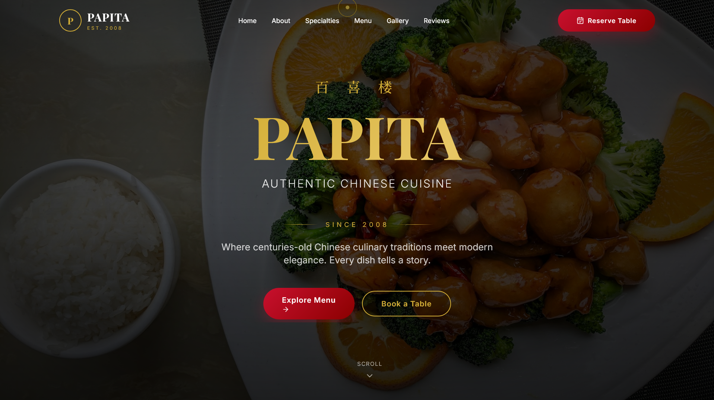

# 🥢 PAPITA — Authentic Chinese Cuisine Landing Page

A beautifully animated, modern landing page for a fictional Chinese restaurant called **PAPITA**. Built with pure HTML, Tailwind CSS (CDN), and vanilla JavaScript — no build tools required.



## 🔴 Live Demo at:
https://maq2008.github.io/PAPITA-CHINESE-RESTAURANT-LANDING-PAGE/
## ✨ Features

- 🎬 **Loading screen** with animated logo
- 🌅 **Sticky navbar** with smooth scroll & backdrop blur
- 🎨 **Hero section** with shimmer gold gradient text reveal
- 🍜 **Animated Chinese characters** floating in background (福, 寿, 喜, 味, 香)
- 📜 **Marquee strip** with restaurant features
- 📖 **About section** with features grid
- 🏆 **Specialties showcase** with hover effects
- 🍱 **Interactive menu** with category filter (14 Chinese dishes)
- 📊 **Animated stats counter**
- 🖼️ **Bento-style gallery** with hover effects
- ⭐ **Customer testimonials**
- 📅 **Reservation form**
- 📱 **Fully responsive** with mobile hamburger menu
- 🎯 **Custom gold cursor** (desktop)
- 📈 **Scroll progress indicator**
- ⬆️ **Smooth scroll animations** (AOS library)

## 🛠️ Tech Stack

- **HTML5**
- **Tailwind CSS** (via CDN)
- **Vanilla JavaScript**
- **AOS** (Animate On Scroll library)
- **Lucide Icons**
- **Google Fonts** (Playfair Display, Inter, Noto Serif SC)

## 🎨 Design

- **Color Palette:** Crimson Red `#C8102E` + Gold `#D4AF37` + Black `#0a0a0a` + Cream `#FAF6EE`
- **Typography:** Playfair Display (headings) + Inter (body) + Noto Serif SC (Chinese)
- **Vibe:** Premium, traditional Chinese with modern elegance

## 📂 Project Structure

```
papita-restaurant-landing-page/
├── index.html          # Main landing page
├── README.md           # This file
└── .gitignore          # Git ignore rules
```

## 🚀 How to Run

Just open `index.html` in any modern browser. No build step needed!

```bash
# Option 1: Double-click index.html
# Option 2: Right-click → Open with browser
# Option 3: Use Live Server in VS Code
# Option 4: From terminal
start index.html
```

## 📜 License

This is a portfolio/demo project. Feel free to use as inspiration for your own restaurant websites.

## 👨‍💻 Created with ❤️

Built for showcasing modern web animation techniques and restaurant web design.
